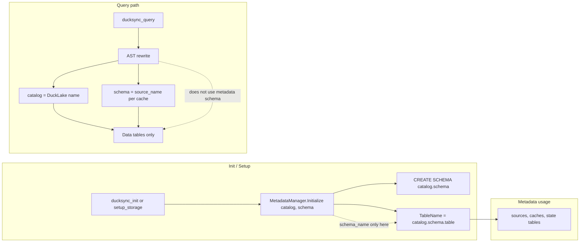

# DuckSync: Harden for v1.5 + GizmoSQL Readiness

## Goal

Implement all changes on the current branch, get tests passing, merge to `main`. From that clean `main`, open the `v1.5-variegata` compatibility branch when DuckDB 1.5 drops.

## Current State

| Item | Value |
|------|-------|
| DuckDB version (submodule + CI) | `v1.4.4` |
| CI workflow | [`MainDistributionPipeline.yml`](../.github/workflows/MainDistributionPipeline.yml) — stable build only, no next-build job |
| Metadata schema | Hardcoded `"ducksync"` in [`metadata_manager.cpp:12`](../src/metadata_manager.cpp:12) |
| `update-version` Makefile target | Partially manual — updates submodules but prints instructions instead of automating sed |
| DuckLake loading | Runtime `INSTALL ducklake; LOAD ducklake;` — no version pin |

---

## Change 1: Automate `make update-version`

**File:** [`Makefile`](../Makefile:46)

Currently lines 46–73 update submodules but print manual instructions for the CI YAML and README. Replace with `sed` automation so `make update-version VERSION=v1.5.0` is a single command.

**Before (lines 58–65):**
```makefile
@echo "Step 2: Update these files manually:"
@echo "  - .github/workflows/MainDistributionPipeline.yml"
@echo "    Change duckdb_version and ci_tools_version to $(VERSION)"
@echo "  - README.md"
@echo "    Update version references"
```

**After:**
```makefile
@echo "Step 2: Updating CI workflow..."
@sed -i '' 's/@v[0-9]\+\.[0-9]\+\.[0-9]\+/@$(VERSION)/g' $(PROJ_DIR).github/workflows/MainDistributionPipeline.yml
@sed -i '' 's/duckdb_version: v[0-9]\+\.[0-9]\+\.[0-9]\+/duckdb_version: $(VERSION)/g' $(PROJ_DIR).github/workflows/MainDistributionPipeline.yml
@sed -i '' 's/ci_tools_version: v[0-9]\+\.[0-9]\+\.[0-9]\+/ci_tools_version: $(VERSION)/g' $(PROJ_DIR).github/workflows/MainDistributionPipeline.yml
@echo "Step 3: Updating README..."
@sed -i '' 's/v[0-9]\+\.[0-9]\+\.[0-9]\+/$(VERSION)/g' $(PROJ_DIR)README.md
@echo "Done! Run: make clean-all && make release && make test"
```

> **Note:** macOS `sed -i ''` (BSD sed) requires the empty string argument. Linux uses `sed -i` without it. The Makefile can detect OS or use a portable approach.

---

## Change 2: Add `duckdb-next-build` CI Job

**File:** [`.github/workflows/MainDistributionPipeline.yml`](../.github/workflows/MainDistributionPipeline.yml)

Per the community extension update guide, add a second job that builds against DuckDB `main`. This is informational — it does not gate releases but alerts you to upcoming API breaks before they land.

```yaml
duckdb-next-build:
  name: Build extension binaries against DuckDB main
  uses: duckdb/extension-ci-tools/.github/workflows/_extension_distribution.yml@main
  with:
    duckdb_version: main
    ci_tools_version: main
    extension_name: ducksync
```

When `duckdb-next-build` starts failing, that's your signal to start the `v1.5-variegata` compat branch.

---

## Change 3: Add `make test-compat` Target

**File:** [`Makefile`](../Makefile)

A new target that checks out a specified DuckDB branch/tag into the submodule, builds, and runs unit tests without requiring Snowflake. Useful for proactively testing against `v1.5-variegata` before the release.

```makefile
.PHONY: test-compat
test-compat:
ifndef BRANCH
	$(error BRANCH is required. Usage: make test-compat BRANCH=origin/v1.5-variegata)
endif
	@echo "Testing compatibility with $(BRANCH)..."
	@cd $(PROJ_DIR)duckdb && git fetch && git checkout $(BRANCH)
	@$(MAKE) clean-all
	@$(MAKE) release
	@echo "Build succeeded for $(BRANCH). Run unit tests manually."
```

---

## Change 4: Parameterize Metadata Schema

### Why

GizmoSQL uses DuckLake with a shared PostgreSQL backend. In multi-tenant or multi-environment setups, hardcoding the metadata schema as `"ducksync"` creates collisions. Making it configurable allows:

- Multiple DuckSync instances sharing one DuckLake (different schema per environment/tenant)
- GizmoSQL deployments where the schema name must fit the host's conventions
- Zero breaking change — default remains `"ducksync"`

### What changes and what does NOT change



The AST rewrite in [`ducksync_extension.cpp:485`](../src/ducksync_extension.cpp:485) rewrites to `catalog = DuckLake name` and `schema = source_name` (per-cache data schema where actual data tables live). The metadata schema is **only** used inside `DuckSyncMetadataManager` for DDL and CRUD on `sources`, `caches`, and `state` tables. No change needed to the query routing path.

### 4a. `metadata_manager.hpp`

**File:** [`src/include/metadata_manager.hpp`](../src/include/metadata_manager.hpp)

- Add `std::string schema_name_` private member (alongside existing `ducklake_name_`)
- Change `Initialize(const std::string &ducklake_name)` → `Initialize(const std::string &ducklake_name, const std::string &schema_name = "ducksync")`
- Update comment on `TableName()` to reflect the new pattern

```cpp
// Initialize schema in the DuckLake catalog
void Initialize(const std::string &ducklake_name, const std::string &schema_name = "ducksync");

// ...private:
std::string ducklake_name_;
std::string schema_name_;  // NEW: e.g., "ducksync" (default) or custom for GizmoSQL
```

### 4b. `metadata_manager.cpp`

**File:** [`src/metadata_manager.cpp`](../src/metadata_manager.cpp)

Two changes:

1. **`TableName()`** (line 10–13): use `schema_name_` instead of hardcoded `"ducksync"`
   ```cpp
   // Before:
   return ducklake_name_ + ".ducksync." + table;
   // After:
   return ducklake_name_ + "." + schema_name_ + "." + table;
   ```

2. **`Initialize()`** (line 32–40): accept and store `schema_name`, use it in `CREATE SCHEMA`
   ```cpp
   void DuckSyncMetadataManager::Initialize(const std::string &ducklake_name, const std::string &schema_name) {
       if (initialized_) { return; }
       ducklake_name_ = ducklake_name;
       schema_name_ = schema_name;  // NEW
       ExecuteSQL("CREATE SCHEMA IF NOT EXISTS " + ducklake_name_ + "." + schema_name_ + ";");
       // ... rest unchanged
   ```

### 4c. `ducksync_extension.cpp` — `ducksync_init`

**File:** [`src/ducksync_extension.cpp`](../src/ducksync_extension.cpp:98)

- `InitBindData`: add `std::string schema_name = "ducksync"` field
- `DuckSyncInitBind`: if `input.inputs.size() >= 2`, read `input.inputs[1]` into `schema_name`
- `DuckSyncInitFunction`: pass `bind_data.schema_name` to `Initialize()`

```cpp
struct InitBindData : public TableFunctionData {
    std::string catalog_name;
    std::string schema_name = "ducksync";  // NEW
    bool done = false;
};
```

In bind:
```cpp
if (input.inputs.size() >= 2) {
    result->schema_name = input.inputs[1].GetValue<string>();
}
```

In function:
```cpp
state.metadata_manager->Initialize(bind_data.catalog_name, bind_data.schema_name);
```

### 4d. `ducksync_extension.cpp` — `ducksync_setup_storage`

**File:** [`src/ducksync_extension.cpp`](../src/ducksync_extension.cpp:42)

- `SetupStorageBindData`: add `std::string schema_name = "ducksync"` field
- `DuckSyncSetupStorageBind`: if `input.inputs.size() >= 3`, read `input.inputs[2]` into `schema_name`
- `DuckSyncSetupStorageFunction`: pass `bind_data.schema_name` to `Initialize()`

### 4e. `ducksync_extension.cpp` — `LoadInternal` function registration

**File:** [`src/ducksync_extension.cpp`](../src/ducksync_extension.cpp:764)

Register overloaded versions so both old and new call signatures work:

```cpp
// ducksync_init: 1-arg (backward compat) + 2-arg (with schema_name)
TableFunction init_func_1("ducksync_init", {LogicalType::VARCHAR},
                          DuckSyncInitFunction, DuckSyncInitBind);
loader.RegisterFunction(init_func_1);

TableFunction init_func_2("ducksync_init", {LogicalType::VARCHAR, LogicalType::VARCHAR},
                          DuckSyncInitFunction, DuckSyncInitBind);
loader.RegisterFunction(init_func_2);

// ducksync_setup_storage: 2-arg (backward compat) + 3-arg (with schema_name)
TableFunction setup_storage_func_2("ducksync_setup_storage",
                                   {LogicalType::VARCHAR, LogicalType::VARCHAR},
                                   DuckSyncSetupStorageFunction, DuckSyncSetupStorageBind);
loader.RegisterFunction(setup_storage_func_2);

TableFunction setup_storage_func_3("ducksync_setup_storage",
                                   {LogicalType::VARCHAR, LogicalType::VARCHAR, LogicalType::VARCHAR},
                                   DuckSyncSetupStorageFunction, DuckSyncSetupStorageBind);
loader.RegisterFunction(setup_storage_func_3);
```

**Backward compatibility:** All existing callers (`ducksync_init('my_lake')`, `ducksync_setup_storage(pg, path)`) are unaffected. New callers can pass an optional schema name.

---

## Change 5: Create `docs/COMPATIBILITY.md`

Document the DuckLake API surface DuckSync depends on, and the DuckDB 1.5 API surfaces to watch. This is the reference for whoever opens the `v1.5-variegata` branch.

### DuckLake API surface

| Behavior | Location in DuckSync | Status |
|----------|---------------------|--------|
| `ATTACH 'ducklake:postgres:...' AS name (DATA_PATH '...')` | [`storage_manager.cpp:95`](../src/storage_manager.cpp:95) | Stable in 0.3 |
| `ducklake_expire_snapshots(name, older_than => INTERVAL)` | [`cleanup_manager.cpp:62`](../src/cleanup_manager.cpp:62) | Stable in 0.3 |
| `ducklake_cleanup_old_files(name, older_than => INTERVAL)` | [`cleanup_manager.cpp:70`](../src/cleanup_manager.cpp:70) | Stable in 0.3 |
| `ducklake_delete_orphaned_files(name)` | [`cleanup_manager.cpp:78`](../src/cleanup_manager.cpp:78) | Stable in 0.3 |
| No `ON CONFLICT` → DELETE+INSERT workaround | [`metadata_manager.cpp:90`](../src/metadata_manager.cpp:90), [`:186`](../src/metadata_manager.cpp:186), [`:384`](../src/metadata_manager.cpp:384) | Workaround; may be fixed in 0.4 |
| No `DEFAULT` expressions | [`metadata_manager.cpp:42`](../src/metadata_manager.cpp:42) | Workaround; may be fixed in 0.4 |

### DuckDB 1.5 API surfaces to watch

| API | Location |
|-----|----------|
| `ExtensionLoader` (`RegisterFunction`, `GetDatabaseInstance`) | [`ducksync_extension.cpp:764`](../src/ducksync_extension.cpp:764) |
| `Connection` / `PreparedStatement` | [`metadata_manager.cpp`](../src/metadata_manager.cpp) — 16+ call sites |
| `Parser::ParseQuery`, `SelectStatement`, `BaseTableRef` | [`ducksync_extension.cpp:460`](../src/ducksync_extension.cpp:460) |
| `TableFunction` registration | [`ducksync_extension.cpp:766`](../src/ducksync_extension.cpp:766) |
| `ClientContextState` / `registered_state->GetOrCreate` | [`query_router.hpp:11`](../src/include/query_router.hpp:11) |

### If DuckLake 0.4 adds `ON CONFLICT` / `DEFAULT`

Simplify [`metadata_manager.cpp`](../src/metadata_manager.cpp) DELETE+INSERT patterns to `INSERT OR REPLACE` and add `DEFAULT CURRENT_TIMESTAMP` to table DDL. These are currently workarounds, not bugs.

---

## After All Changes: Merge Path

```
current branch (all changes above)
    → tests pass (make test)
    → manual test (bash docs/manual_test.sh)
    → PR → merge to main
    → git tag v0.1.1 (or v0.2.0 depending on scope)
    → git checkout -b v1.5-variegata  ← open this when DuckDB 1.5 drops
```

---

## GizmoSQL Drop-In Notes

- **Shared state**: Schema parameterization (Change 4) lets multiple DuckSync instances coexist in one GizmoSQL DuckLake by using different `schema_name` values
- **Zero-overhead ingestion**: Already true — refresh uses `CREATE OR REPLACE TABLE ... AS SELECT *` inside the server
- **Replacement scan (future)**: True "drop-in" `SELECT * FROM snowflake_table` without `ducksync_query()` requires implementing [`QueryRouter::Register`](../src/query_router.cpp:12) (currently a no-op). Out of scope for now — the "final inch" for a full GizmoSQL drop-in experience.
